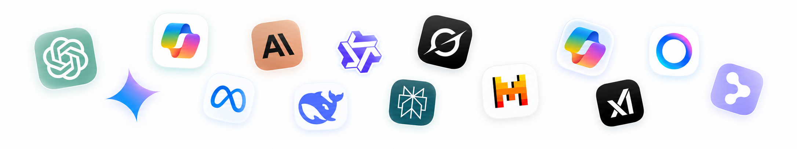

::: {.iasi-page-heading}

Ingeniería Asistida por Sistemas Inteligentes (IASI)

:::: {.iasi-epigraph}
*Si la implementación cada vez cuesta menos, el conocimiento cada vez vale más (Grandez)*
::::

:::

::: {.iasi-home-hero}

:::: {.iasi-home-copy}

::::: {.construction-banner}
{.construction-banner-image}
:::::

Las metodologías actuales de ingeniería de software fueron concebidas para equipos humanos que diseñan y construyen sistemas fundamentalmente pasivos. **Ese supuesto empieza a dejar de ser válido.**

Hoy podemos, y debemos, incorporar **sistemas inteligentes como parte del equipo de ingeniería**, capaces de participar en el análisis, el diseño, la implementación, la validación y la evolución del propio sistema, pero es necesario integrarlos de forma **explícita, sistemática y gobernada** dentro de los procesos.

**IASI nace para definir cómo debe hacerse ingeniería de software en este nuevo contexto.**

Sus objetivos son:

::::: {.iasi-objectives}

A) **Enseñar** a utilizar los sistemas inteligentes de forma coherente, productiva y alineada con los procesos de ingeniería.

B) **Definir** una metodología que integre los sistemas inteligentes como parte del equipo y del proceso de ingeniería.

C) **Establecer** un conjunto de principios, patrones y buenas prácticas para su utilización.

D) **Construir** un framework que permita aplicar todo lo anterior de forma sistemática, reproducible y evolutiva.

:::::

Todo ello mediante <strong>fundamentos, experimentación y casos reales</strong>.

::::

:::

## Abierto por diseño {#contribute}

Aunque IASI nace como una iniciativa personal, **no está pensada para construirse en solitario ni para pertenecer a una sola persona, sino a la comunidad**.

Sus ideas, métodos y artefactos se desarrollan de forma abierta, con la intención de que puedan ser utilizados, discutidos, cuestionados y mejorados por otros: **Profesionales, Equipos y Organizaciones son bienvenidos a participar**, ya sea aportando conocimiento, proponiendo problemas, desarrollando nuevos artefactos o experimentando con esta forma de entender la ingeniería.

IASI empieza aquí. **Lo que llegue a ser dependerá también de quienes quieran construirlo.**

::: {.iasi-ai-banner}
{.iasi-ai-banner-image}
:::
